# Setup cert-manager in local K8s cluster using nginx-ingress & Cloudflare DNS

<a id="readme-top"></a>

### Step:
1. Apply nginx deployment
2. Apply nginx clusterIp service
3. Install ingress-nginx
4. Setup Local domain name pointing to Load Balancer IP
5. Create the Cloudflare API token
6. Setup cert-manager
7. Enable TLS on ingress

#### Prerequisite:

MetalLB is already set up in this local k8s cluster.

### 1. Apply nginx deployment

```
cat <<EOF > nginx-deploy.yaml
apiVersion: apps/v1
kind: Deployment
metadata:
  name: nginx-deployment
  labels:
    app: nginx
spec:
  replicas: 3
  selector:
    matchLabels:
      app: nginx
  template:
    metadata:
      labels:
        app: nginx
    spec:
      containers:
      - name: nginx
        image: nginx:1.27
        ports:
        - containerPort: 80
EOF
```
`kubectl apply -f nginx-deploy.yaml`

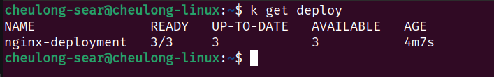

### 2. Apply nginx clusterIp service
```
cat <<EOF > nginx-svc.yaml
apiVersion: v1
kind: Service
metadata:
  name: nginx-service
spec:
  type: ClusterIP
  selector:
    app: nginx
  ports:
    - port: 80
      targetPort: 80
EOF
```
`kubectl apply -f nginx-svc.yaml`

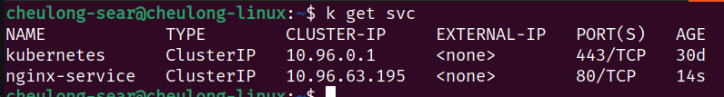

### 3. Install ingress-nginx
Next we will install ingress-nginx using helm
```
helm upgrade --install ingress-nginx ingress-nginx \
  --repo https://kubernetes.github.io/ingress-nginx \
  --namespace ingress-nginx --create-namespace
```
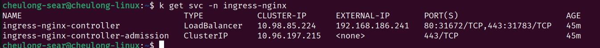

set up ingress pointing to nginx service
```
cat <<EOF > ingress-svc.yaml
apiVersion: networking.k8s.io/v1
kind: Ingress
metadata:
  name: ingress-nginxservice
  namespace: default
  annotations:
    nginx.ingress.kubernetes.io/rewrite-target: /
spec:
  ingressClassName: nginx
  rules:
  - host: nginx.cheulong-homelab.com
    http:
      paths:
      - path: /
        pathType: Prefix
        backend:
          service:
                name: nginx-service
                port:
                  number: 80

EOF
```
`kubectl apply -f ingress-svc.yaml`

### 4. Setup Local domain name pointing to Load Balancer IP

If you go to `http://192.168.186.241` now you will see 404 error, it means ingress works correctly, we need to setup domain name to point to that IP.

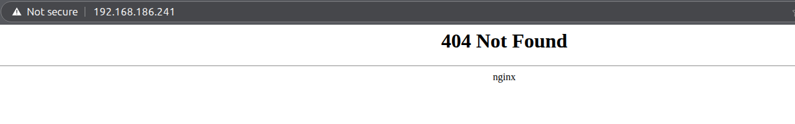

Type `sudo nano /etc/hosts` and add like below

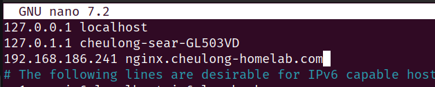

now go to `http://nginx.cheulong-homelab.com` 

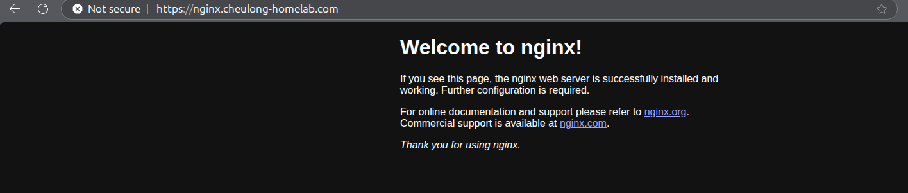

Next step, we need to use cert-manager to generate the certificate for this domain.

### 5. Create the Cloudflare API token

1. Log in to Cloudflare Dashboard https://dash.cloudflare.com/
2. Click your profile icon (top right) → “My Profile”
3. Go to API Tokens → click “Create Token”
4. Choose “Edit zone DNS” template
5. Under “Permissions”, make sure it includes:
`Zone | DNS | Edit`
6. Under “Zone Resources”, choose: `Include | All zones`

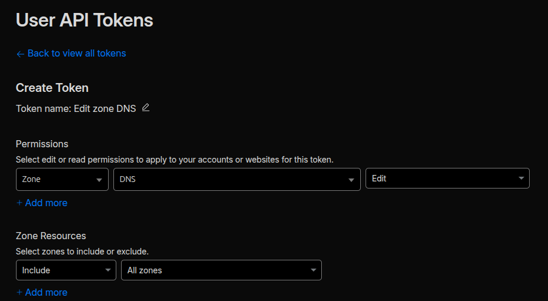

7. Click Continue to summary → Create Token
8. Copy the generated token and keep it safe — you’ll only see it once.


### 6. Setup cert-manager

1. deploy the cert-manager using helm
```
helm install \
  cert-manager oci://quay.io/jetstack/charts/cert-manager \
  --version v1.19.1 \
  --namespace cert-manager \
  --create-namespace \
  --set crds.enabled=true
```
2. deploy letsencrypt cluster issuer

Create secret for cloudflare token api
```
kubectl create secret generic cloudflare-api-token-secret \
  --from-literal=api-token='cfapi_xxxxxxxxxxxxxxxxxxxxxxxxxxxxxxxxx' \
  -n cert-manager

```

Let's encrypt will use cloudflare dns to verify the ownership.

```
cat <<EOF > cluster-issuer.yaml
apiVersion: cert-manager.io/v1
kind: ClusterIssuer
metadata:
  name: letsencrypt-dns
spec:
  acme:
    email: searcheulong@gmail.com
    server: https://acme-v02.api.letsencrypt.org/directory
    privateKeySecretRef:
      name: letsencrypt-dns-key
    solvers:
    - dns01:
        cloudflare:
          apiTokenSecretRef:
            name: cloudflare-api-token-secret
            key: api-token
    # Add additional solvers here if needed
    # - http01:
    #     ingress:
    #       ingressClassName: nginx
EOF
```
`kubectl apply -f cluster-issuer.yaml`

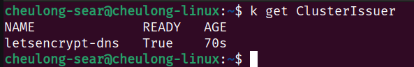

3. deploy the certificate
```
cat <<EOF > cert.yaml
apiVersion: cert-manager.io/v1
kind: Certificate
metadata:
  name: cheulong-nginx-cert
  namespace: default
spec:
  secretName: cheulong-nginx-tls
  dnsNames:
    - nginx.cheulong-homelab.com
  issuerRef:
    name: letsencrypt-dns
    kind: ClusterIssuer
EOF
```
`kubectl apply -f cert.yaml`

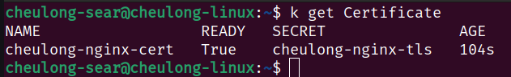

You can check the detail

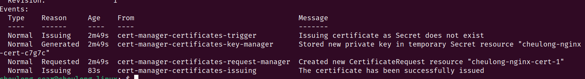

The tls also was created 

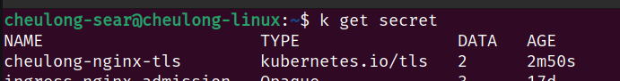

### 7. Enable TLS on ingress

```
cat <<EOF > ingress-svc.yaml
apiVersion: networking.k8s.io/v1
kind: Ingress
metadata:
  name: ingress-nginxservice
  namespace: default
  annotations:
    nginx.ingress.kubernetes.io/rewrite-target: /
spec:
  tls: 
  - hosts:
    - nginx.cheulong-homelab.com
    secretName: cheulong-nginx-tls
  ingressClassName: nginx
  rules:
  - host: nginx.cheulong-homelab.com
    http:
      paths:
      - path: /
        pathType: Prefix
        backend:
          service:
                name: nginx-service
                port:
                  number: 80

EOF
```
`kubectl apply -f ingress-svc.yaml`

Now if you type `https://nginx.cheulong-homelab.com/`, it will connect successfully.

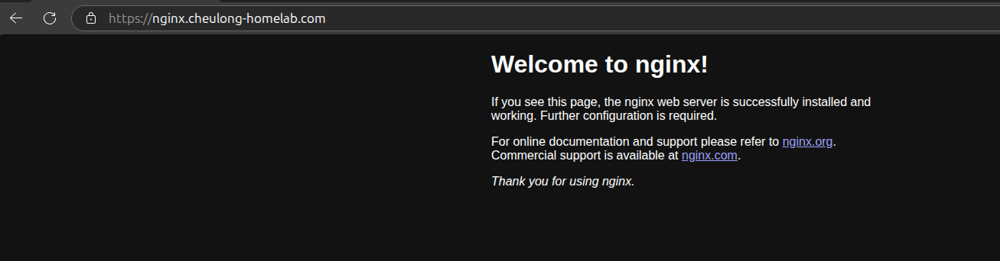

=== Done ===

[Code for this article](https://github.com/cheulong/devops/tree/main/k8s/cert-manager)

<p align="right">(<a href="#readme-top">back to top</a>)</p>

Leave a comment if you have any questions.

===========
**Please keep in touch**
  [Portfolio](cheulongsear.dev)
  [Linkedin](https://www.linkedin.com/in/cheulongsear/)
  [Github](https://github.com/cheulong)
  [Youtube](https://www.youtube.com/@moshi-moshi-devops)
