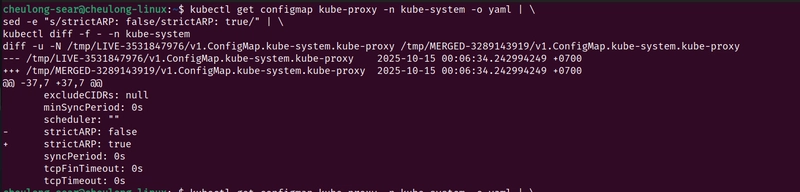
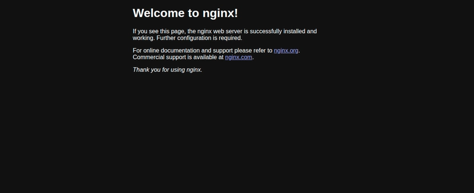

<a id="readme-top"></a>

This article will show you how to install MetalLB in K8s and expose a load balancer in your network.
Please refer to the [official](https://metallb.io/installation/) doc for more detail.

## Preparation
If you’re using kube-proxy in IPVS mode, since Kubernetes v1.14.2 you have to enable strict ARP mode.
`run`
```
kubectl get configmap kube-proxy -n kube-system -o yaml | \
sed -e "s/strictARP: false/strictARP: true/" | \
kubectl diff -f - -n kube-system
```
if you see something like this



then run 
```
kubectl get configmap kube-proxy -n kube-system -o yaml | \
sed -e "s/strictARP: false/strictARP: true/" | \
kubectl apply -f - -n kube-system
```
## Installation with Helm
```
helm repo add metallb https://metallb.github.io/metallb
helm install metallb metallb/metallb --create-namespace -n metallb-system 
```
## L2 configuration
create `metallb-config.yaml`
```
apiVersion: metallb.io/v1beta1
kind: IPAddressPool
metadata:
  name: default-ip-pool
  namespace: metallb-system
spec:
  addresses:
  - 192.168.186.241-192.168.186.250
---
apiVersion: metallb.io/v1beta1
kind: L2Advertisement
metadata:
  name: default
  namespace: metallb-system
spec:
  ipAddressPools:
  - default-ip-pool
```
run `kubectl apply -f metallb-config.yaml`

**Note**: ip range need to be inside `192.168.186.0/24` range
### Check if it works
`kubectl get ipaddresspools -n metallb-system`

`kubectl get l2advertisement -n metallb-system`
## Deploy nginx
run `kubectl create deploy nginx --image nginx:latest`
## Expose nginx with load balancer
run `kubectl expose deploy nginx --port 80 --type LoadBalancer`
```
cheulong-sear@cheulong-linux:~$ k get svc
NAME         TYPE           CLUSTER-IP      EXTERNAL-IP       PORT(S)        AGE
kubernetes   ClusterIP      10.96.0.1       <none>            443/TCP        16d
nginx        LoadBalancer   10.106.24.222   192.168.186.242   80:32454/TCP   69s
test-nginx   NodePort       10.99.173.211   <none>            80:32544/TCP   16d
```
go to `192.168.186.242`



=== Done ===

<p align="right">(<a href="#readme-top">back to top</a>)</p>

Leave a comment if you have any questions.

===========

**Please keep in touch**

  [Portfolio](cheulongsear.dev)

  [Linkedin](https://www.linkedin.com/in/cheulongsear/)

  [Github](https://github.com/cheulong)

  [Youtube](https://www.youtube.com/@allo-devops)

